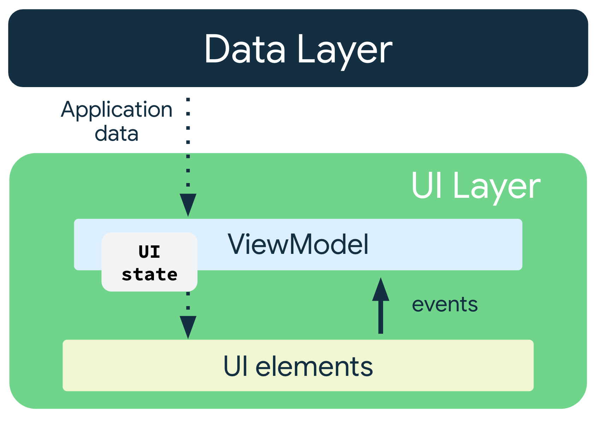

# loxodon-framework-mvi介绍
## 首先感谢loxodon-framework框架作者， loxodon-framework是一个MVVM双向数据绑定的用于Unity开发的框架，在代码质量、可读性、性能等方面非常优秀。
https://github.com/vovgou/loxodon-framework
### MVI架构图如下

MVI架构是谷歌最新的UI架构，是在MVVM基础上解决一些生产环境的痛点而产生单项数据、响应式、不可变状态的新型框架，目前主要是在Android原生上使用的比较多，Unity以及其他方面基本没有，所以才创建了loxodon-framework-mvi库。
###
loxodon-framework-mvi在loxodon-framework框架上进行扩展实现MVI架构，没有修改loxodon-framework任何代码，通过Nuget进行包管理引用loxodon-framework，实现了响应式编程、单数据流、不可变状态，主要依赖如下开源库实现：
### R3 https://github.com/Cysharp/R3
### loxodon-framework-mvi 类介绍
#### IIntent意图类，用于执行一系列的意图
#### IMviResult结果类，用于生成意图的结果
#### IState状态类，表示UI进行显式的状态信息
#### MviViewModel类是继承loxodon-framework框架的ViewModelBase类，ViewModelBase类是用来处理业务逻辑的，MVVM所有的业务逻辑基本都写在ViewModel中
#### Store类是管理状态的更新，用于生成新的状态

## 使用教程
### 1、每一个意图都需于要实现Intent接口
### 2、UI界面需要刷新的状态，每个状态都要实现IState接口,状态类最好使用Record类型使其不可变，
### 3、每个模块或者说每个界面都要有一个Store进行对状态的管理，所以需要继承Store类，具体可以参考Demo
### 4、View和ViewModel绑定具体教程参考loxodon-framework框架，ViewModel只用绑定相关UI属性和对应点击事件即可,在ViewModel的构造函数中执行绑定BindStore方法，具体看LoginViewModel的构造函数，绑定按钮事件需要执行EmitIntent方法触发意图，具体看Login()方法
具体实现代码可以看Demo中的登录实例的代码，其中加载进度的代码是loxodon-framework框架Demo的并没有进行修改，登录Demo分别定义了Intent、State、Store、ViewModel、View、Const文件夹
## Demo演示
打开Unity工程找到Samples\Loxodon Framework\2.0.0\Examples\Launcher场景，直接运行即可，该项目工程是在官方Demo基础上进行修改，具体可以进行对比，使用MVI架构后ViewModel和View之间只存在绑定关系不存在业务逻辑关系，所有的业务逻辑都分发到Intent中